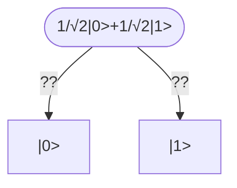
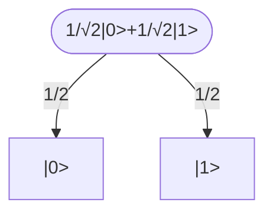

# 本連載について
IBM Quantum Learning で学んだことを日本語でわかりやすくまとめて連載しています。詳しくはこちら⇨[【超初心者向け】最高の教材「IBM Quantum Learning」で始める量子情報 #1-1 古典情報の基礎](https://qiita.com/yutaki0702/items/c7a2e5cb1320dc29a54f)

> ### 🎓 本連載の内容
> - IBM Quantum Learning
└── シリーズ：量子情報と量子計算
　　　　└── コース１：量子情報の基礎
　　　　　　　　└── 単一システム　``📍今回の内容``
> 📖 [公式教材はこちら](https://quantum.cloud.ibm.com/learning/ja)

# 前提知識
- ある程度の高校数学、高校物理
- 行列計算とディラック記法
　　　└── 記事はこちら(近日公開予定！フォローしてお待ちください)

# 量子情報を始める前に

この記事から、ついに量子情報に踏み込みます。前回、丁寧に古典情報を学んだ方ならスラスラ読めてしまうと思うのですが、この先学んでいく上で最も大切なことは

　**古典情報との対応関係を常に意識しながら学習を進めていく**

ことです。これを忘れてしまうと最初の方はスラスラ進みますが、後で必ず詰まってしまうときが来るはずです。

そんなことが起きないようにこの記事でも古典情報との比較を示しながら進めていくので、ゆっくりしっかり進んでいきましょう。

# 前回の復習

まずは、古典状態が何であったかを思い出してみましょう。古典状態とは、ある系における日常的に私たちが使ってる「状態」と同じでしたね。そして状態は**ベクトル**で表すのでした。前回扱った系のいくつかを復習してみましょう。

:::note
復習：**サイコロ**
- 系X：サイコロ
- 状態のセット：$\Sigma=${$1, 2, 3, 4, 5, 6$}
- 「2」という状態：
```math
\begin{pmatrix}0\\1\\0\\0\\0\\0\end{pmatrix}=\ket{2}
```
- サイコロを振る前の状態：
```math
\begin{aligned}
&\frac{1}{6}\left[
\begin{pmatrix}1\\0\\0\\0\\0\\0\end{pmatrix}+
\begin{pmatrix}0\\1\\0\\0\\0\\0\end{pmatrix}+
\begin{pmatrix}0\\0\\1\\0\\0\\0\end{pmatrix}+
\begin{pmatrix}0\\0\\0\\1\\0\\0\end{pmatrix}+
\begin{pmatrix}0\\0\\0\\0\\1\\0\end{pmatrix}+
\begin{pmatrix}0\\0\\0\\0\\0\\1\end{pmatrix}\right] \\
&= \frac{1}{6}\left(\ket{1}+\ket{2}+\ket{3}+\ket{4}+\ket{5}+\ket{6}\right) \\
&= \frac{1}{6}\sum^{6}_{i=1}\ket{i}
\end{aligned}
```
:::

:::note
復習：**ビット**　**```📍重要！```**
- 系Z：ビット
- 状態のセット：$\Gamma=${$0, 1$}
- 「0」、「1」という状態
```math
\begin{pmatrix}1\\0\end{pmatrix} = \ket{0},　　　
\begin{pmatrix}0\\1\end{pmatrix} = \ket{1}
```
:::

このように、状態を表したベクトルを**状態ベクトル**と言いました。

:::note
**(古典)状態ベクトル**
各要素をその要素に対応する状態になる確率として、ある状態を表現したベクトル
:::

そして状態ベクトルには以下のような性質がありました。

:::note
性質：**(古典)状態ベクトル**
- **各要素は非負**
- **各要素の和が1**
:::

# 量子とは

さて、ここからが本題です。ですが、量子情報に踏み込む前に、まずはじめに大前提「量子とは何か」について確認しましょう。

:::note
用語：**量子**
**粒子**と**波**の性質を併せ持った物質やエネルギーの単位
:::

かつて物理学の世界では、粒子(電子や原子)と波動(光など)は明確に分けて考えられていました。しかし研究が進むにつれ、小さい世界では電子や原子のような粒子に「波動」の性質が見られたり、光に「粒子」としての性質が発見されたりするようになります。そのような両者の性質を併せ持った物質やエネルギーが「量子」と呼ばれるようになりました。
(正確には、小さな世界のエネルギーは連続したものではなく、とびとびの「最小単位（塊）」を持つことが分かり、その単位が「量子」と名付けられ、それに対して上記のような性質が発見されたそうです。)

そして、そのような量子という不思議な物質が主役となる小さな世界では、我々の知る古典力学は通用しません。この世界では、テレポーテーションや壁のすり抜けのような不思議な現象が簡単に起こってしまいます。このような世界のルールを記述しようとしてできたのが**量子力学**です。

# 量子状態

今述べたように、量子の世界と古典の世界は違うので、量子の状態（量子状態）は古典のそれとは違った性質を持ちます。

前回、**古典状態はベクトルとして表現できる**ことを学びました。

これにならって、**量子状態もベクトルとして表現したい**わけです。

量子状態ベクトルは以下のような性質によって特徴づけられます。

:::note
用語：**量子状態ベクトル**
量子の状態を表現するベクトル
:::

:::note
性質：**量子状態ベクトル**
- **各要素は複素数**
- **各要素の絶対値の二乗の和が1**
:::

:::note warn
**注！**
いきなり「これが量子状態ベクトルです」と言われても量子状態が何かを説明していないので困惑するかと思いますが、今は「これが量子の状態を表現するベクトルなんだ」と割り切って、まずは古典とは違う**量子状態ベクトル**というものに慣れていきましょう。
:::

文字だけだとわかりづらいので、具体例をいくつか見ていきましょう。以下の二つの例はどちらも上記二つの性質を満たします。

>例1
>```math
>\begin{pmatrix}
>\frac{1}{\sqrt{2}}\\\frac{i}{\sqrt{2}}
>\end{pmatrix}
>```
>
><details open><summary>理由</summary>
>
>```math
>\begin{aligned}
>&\left|\frac{1}{\sqrt{2}}\right|^2= \left(\frac{1}{\sqrt{2}}\right)^2=\frac{1}{2} \\
>&\left|\frac{i}{\sqrt{2}}\right|^2= \left(\frac{1}{\sqrt{2}}\right)^2=\frac{1}{2}
>\end{aligned}
>```
>より
>```math
>\left|\frac{1}{\sqrt{2}}\right|^2+\left|\frac{i}{\sqrt{2}}\right|^2=\frac{1}{2}+\frac{1}{2}=1
>```
>よって、全ての要素が複素数であり、各要素の絶対値の二乗の和が1であるため、これは量子状態ベクトルである。
></details>
>
>例2
>
>```math
>\begin{pmatrix}
>\frac{1}{\sqrt{3}}\\\frac{i}{2}\\\frac{2+i}{2\sqrt{3}}
>\end{pmatrix}
>```
><details><summary>理由</summary>
>
>```math
>\begin{aligned}
>&\left|\frac{1}{\sqrt3}\right|^2=\left(\frac{1}{\sqrt{3}}\right)^2=\frac{1}{3} \\　　
>&\left|\frac{i}{2}\right|^2=\left(\frac{1}{2}\right)^2=\frac{1}{4} \\
>&\left|\frac{2+i}{2\sqrt{3}}\right|^2=\frac{\left|2+i\right|^2}{\left|2\sqrt{3}\right|^2}=\frac{2^2+1^2}{12}=\frac{5}{12}
>\end{aligned}
>```
>より
>```math
>\left|\frac{1}{\sqrt{3}}\right|^2+\left|\frac{i}{2}\right|^2+\left|\frac{2+i}{2\sqrt{3}}\right|^2=\frac{1}{3}+\frac{1}{4}+\frac{5}{12}=1
>```
>よって、全ての要素が複素数であり、各要素の絶対値の二乗の和が1であるため、これは量子状態ベクトルである。
></details>

今扱ったベクトル

```math
\begin{pmatrix}
\frac{1}{\sqrt{2}}\\\frac{i}{\sqrt{2}}
\end{pmatrix}　　　
\begin{pmatrix}
\frac{1}{\sqrt{3}}\\\frac{i}{2}\\\frac{2+i}{2\sqrt{3}}
\end{pmatrix}
```
はどちらも量子状態ベクトルであるため、**なんらかの系の量子状態を表現**します。

ここで、今回もLpノルムを用いて状態ベクトルの性質を表現してみましょう。

:::note
性質：**量子状態ベクトル**
- 各要素は複素数
- **ユークリッドノルム($L^{2}$ノルム)が1**
:::

> #### 補足（ノルムとは？）　``再掲``
> 空間での**ベクトルの大きさ**(長さ)を一般化したもの。
> 特に、Lpノルムは$v = (a_{1} a_{2} ... a_{n})^{T}$に対して
> ```math
> L^{p} = ||v||_{p} = \sqrt[p]{|a_{1}|^{p} + |a_{2}|^p + ... + |a_{n}|^p}
> ```
> と定義したもの。
> 今回は$p=2$なので
> ```math
> L^{2} = \sqrt{|a_{1}|^2 + ... + |a_{n}|^2 }
> ```
> であり、これが1であることは、ベクトルの要素の絶対値の二乗和が1になることと同値である。

古典状態ベクトルと比較して整理してみましょう。

||古典状態ベクトル |量子状態ベクトル |
|:-:|:-:|:-:|
|**表現できる状態**|古典状態|量子状態|
|**ベクトルの要素**|非負実数|複素数|
|**満たすべき条件**|要素の**和が1**|要素の**絶対値の二乗の和が１**|
||$\sum_{i}a_i=1$ |$\sum_{i}\lvert a_i\rvert^2=1$|
||$L^{1} = 1$|$L^{2} = 1$|

## 練習問題1

以下のベクトルについて、古典状態ベクトル、量子状態ベクトル、どちらでもある、どちらでもないの4パターンに分類せよ。

```math
1. 　\begin{pmatrix}\frac{i}{\sqrt{3}}\\\frac{\sqrt{6}}{3}\end{pmatrix}　　2.　\begin{pmatrix}1\\0\end{pmatrix}　　3.　\begin{pmatrix}\frac{1}{2}\\\frac{i}{3}\\\frac{1}{6}\end{pmatrix}　　4.　\begin{pmatrix}\sqrt{2}\\1-\sqrt{2}\end{pmatrix}
```

<details><summary>ヒント</summary>

:::note
性質：**(古典)状態ベクトル**
- **各要素は非負**
- **マンハッタンノルムが1**(「要素の和が1」と同値)
:::
:::note
性質：**量子状態ベクトル**
- **各要素は複素数**
- **ユークリッドノルムが1**(「要素の絶対値の二乗和が１」と同値)
:::

</details>

<details><summary>解答</summary>

1. 量子状態　2. どちらでもある　3. どちらでもない　4. どちらでもない

</details>

<details><summary>解説</summary>
1
要素が非負実数でないため、古典状態ベクトルではない。
次に、要素は複素数であり、ユークリッドノルムは

```math
\begin{aligned}
L^{2} 
&= \left|\frac{i}{\sqrt{3}}\right|^2 + \left|\frac{\sqrt{6}}{3}\right|^2 \\
&= \frac{1}{3} + \frac{6}{9} \\
&= 1
\end{aligned}
```

よって、以下２つの条件

- 要素が複素数
- ユークリッドノルムが1

を満たすため、量子状態ベクトルである。

2
要素が非負実数であり、マンハッタンノルムについて

```math
\begin{aligned}
L^{1} 
&= 1 + 0 \\
&= 1
\end{aligned}
```

より、古典状態ベクトルである。
また、要素は複素数であり、ユークリッドノルムについて

```math
\begin{aligned}
L^{2} 
&= |1|^2 + |0|^2 \\
&= 1 + 0 \\
&= 1
\end{aligned}
```

より、量子状態ベクトルである。
したがって、このベクトルは古典状態ベクトルであり量子状態ベクトルでもある。

3
要素が非負実数でないため、古典状態ベクトルではない。
要素は複素数であるが

```math
\begin{aligned}
L^{2}
&= \left|\frac{1}{2}\right|^2 + \left|\frac{i}{3}\right|^2 + \left|\frac{1}{6}\right|^2 \\
&= \frac{1}{4} + \frac{1}{9} + \frac{1}{36} \\
&= \frac{7}{18} \neq 1
\end{aligned}
```

より、ユークリッドノルムは1でないため、量子状態ベクトルでない。
よってこのベクトルは古典状態ベクトルでも量子状態ベクトルでもない。

4
要素について

```math
1 - \sqrt{2} < 0
```

より、要素が非負実数でないため古典状態ベクトルでない。
また、要素は複素数であるが

```math
\begin{aligned}
L^{2} 
&= \left|\sqrt{2}\right|^2 + \left|1-\sqrt{2}\right|^2 \\
&= 2 + 3 - 2\sqrt{2} \\
& = 5 - 2\sqrt{2} \neq 1
\end{aligned}
```

より、量子状態ベクトルではない。
したがって、このベクトルは古典状態ベクトルでも量子状態ベクトルでもない。
</details>

---

量子状態ベクトルに慣れてきたところで、次に具体的な系として「量子ビット」について見ていきましょう。

## 系　量子ビット　

例えば、量子ビットの状態は量子状態ベクトルで表されます。すなわち、量子ビットは量子状態にあります。

:::note 
用語：**量子ビット**
量子コンピュータにおける情報の最小単位
:::

従来のビット(古典ビット)は0か1という状態しか取れませんでしたが、量子ビットは量子状態を持つので**量子状態ベクトルであることを満たす任意の状態**を取れます。

> ### 代表的な量子状態
> ```math
> \begin{aligned}
> &\ket{0} = \begin{pmatrix}1\\0\end{pmatrix}　　　
> \ket{1} = \begin{pmatrix}0\\1\end{pmatrix} \\
> &\ket{+} = \begin{pmatrix}\frac{1}{\sqrt{2}}\\\frac{1}{\sqrt{2}}\end{pmatrix} = \frac{1}{\sqrt{2}}\left(\begin{pmatrix}1\\0\end{pmatrix}+\begin{pmatrix}0\\1\end{pmatrix}\right) = \frac{1}{\sqrt{2}}\left(\ket{0}+\ket{1}\right) \\
> &\ket{-} = \begin{pmatrix}\frac{1}{\sqrt{2}}\\-\frac{1}{\sqrt{2}}\end{pmatrix} = \frac{1}{\sqrt{2}}\left(\begin{pmatrix}1\\0\end{pmatrix} -\begin{pmatrix}0\\1\end{pmatrix}\right) = \frac{1}{\sqrt{2}}\left(\ket{0} - \ket{1}\right) \\
> \end{aligned}
> ```

量子状態である|+>や|->は、|0>と|1>の状態の線形和で表現されています。これを0と1の**重ね合わせ**と呼んだりします。よく「量子コンピュータは0と1が重なった状態を取ることができる」と言われたりしますが、それはこのことを指しています。

# 測定

測定とは、**系の状態を確定すること**でした。古典状態では、**確率状態から決定状態へ遷移させる操作**とも呼んでいました。

これを量子の世界にも当てはめるとどうでしょう。

量子ビットを例にとって考えてみます。

例えば先ほど扱った状態

```math
\ket{+}= \pmatrix{\frac{1}{\sqrt{2}}\\\frac{1}{\sqrt{2}}}
```

について、これは0と1の重ね合わせなのでまだ**状態は確定していません**。

これを測定（状態を確定）してみましょう。



上のグラフのようになるはずです。

### 確率

ここで、それぞれの状態になる**確率**を考えます。

古典では、その状態に対応する要素がそのまま確率でした。今回はどうでしょう。

古典と同様だとすると、それぞれについて

|0>になる確率：$\frac{1}{\sqrt{2}}$
|1>になる確率：$\frac{1}{\sqrt{2}}$

となります。しかし、これらの確率の和を考えてみると

```math
\begin{aligned}
\frac{1}{\sqrt{2}} + \frac{1}{\sqrt{2}} 
&= \frac{2}{\sqrt{2}} \\
&= \sqrt{2}
\end{aligned}
```

となり**１を超えてしまいます**。確率の和は1になるはずなのでこれではうまくいかないわけです。

実は量子状態を測定したときの、それぞれの状態が出る確率はボルンの法則というものによって決まっています。

:::note
用語：**ボルンの規則**
量子状態において、ある状態が測定される確率は

**その状態に対応する要素の絶対値の二乗**

である。
:::

これを踏まえて考えると

```math
\left|\frac{1}{\sqrt{2}}\right|^2 = \frac{1}{2}
```

より
|0>になる確率：$\frac{1}{2}$
|1>になる確率：$\frac{1}{2}$

となります。和が1になっていることからも、これを確率として考えて良さそうです。先ほどの図は以下のようになります。



ここで一般に、ボルンの法則によって計算された確率の和は、要素の絶対値の二乗の和ですが、**量子状態はこれが1であるという性質がありました**(ユークリッド
ノルムが1($L^{2} = 1$))。よって確率の和は、量子状態ベクトルを考えれば必ず1になり、**整合性が取れている**ことがわかります。

### ブラケット記法での表現

前回と同様に、ブラケット記法を用いて確率を表現し直してみましょう。

古典状態では、測定後ある状態になる確率は、**「今の状態ベクトル」と「確率を抽出したい状態に対応するベクトル」との内積をとる**ことで抽出できるのでした。

例えば、サイコロを振って3になる確率は$\bra{3}\ket{\phi}$、コインを投げて表になる確率は$\bra{表}\ket{\phi}$と内積を取れば、すぐに求まります。

なぜこの方法で確率がもとまるのかというと、各状態に対応する要素が確率を表しており、それが上記の方法で抽出できるからでした。

これを量子状態ベクトルにも適用します。量子状態における「ある状態になる確率」は、「その状態に対応する要素の絶対値の二乗」でした(ボルンの規則)。「その状態に対応する要素」が古典のときの確率であるので、今回はそれの絶対値の二乗です。

すなわち

:::note
量子状態ベクトルにおいて、測定後ある状態になる確率は、**「今の状態ベクトル」と「確率を抽出したい状態に対応するベクトル」との内積の絶対値の二乗**をとることで抽出できる。

**具体例**

量子ビットを考える。量子ビットの量子状態を
```math
\ket{\Psi} = \frac{1}{\sqrt{5}}\ket{0} + \frac{2}{\sqrt{5}}\ket{1}
```
とする。このとき0になる確率(P(outcome = 0))は
```math
\bra{0}\ket{\Psi} = (\ket{0}の要素) \left(= \frac{1}{\sqrt{5}}\right)
```
であるため
```math
P(outcome = 0) = |\bra{0}\ket{\Psi}|^2 \left(= \frac{1}{5}\right)
```
と表現できる。
:::

:::note warn
**注！**
ここまで測定という言葉を単にそのまま多用してきましたが、実はこの測定は、**標準基底測定**という特別なもので、一般の測定はまた別の定義があります。ただ、それを扱うのはまた先の話なので、今は「ここで扱ったのは一つの特殊な測定なんだな」とだけ認識できていれば大丈夫です。
:::

# 操作

古典状態では、**確率行列**という行列のみ操作が許されていました。

それは、確率行列以外の行列を古典状態にかけてしまうと行き着く先は古典状態ではなくなってしまうからでした。

これを踏まえた上で、量子状態間の操作を考えたいわけです。

まず量子状態も古典状態と同じくベクトルであるので、それらの操作は**行列**を用いて行います。しかし今回も、ある特別な行列のみが許されます。

量子状態間の操作は、**ユニタリ行列**という行列のみ許されます。

:::note
用語：**ユニタリ行列**
```math
U^{\dagger}U = UU^{\dagger} = I
```
以上の数式を満たす行列$U$

> $U^{\dagger}$ ：随伴行列。エルミート共役。$U$の共役転置を表す($ = \overline{U}^{T}$)。数学では、$U^{*}$と表されることも多い。
:::

なぜ、この操作において**ユニタリ行列のみが許される**のでしょうか。

ある量子状態ベクトル、$\ket{\Psi}$(プサイベクトル)への操作を考えます。

$\ket{\Psi}$は量子状態ベクトルなので、ユークリッドノルムは1です。

```math
||\ket{\Psi}|| = 1
```

ここで操作後の量子状態ベクトルについて

```math
\begin{aligned}
||U\ket{\Psi}||^2
&=  \bra{\Psi}U^{\dagger}U\ket{\Psi} 　(\because 自身のとの内積はユークリッドノルムの二乗に対応)\\
&= \bra{\Psi}\ket{\Psi} 　(\because Uはユニタリ行列より、U^{\dagger}U = I)\\
&= ||\ket{\Psi}||^2 \\
&= 1
\end{aligned}
```
```math
\therefore ||U\ket{\Psi}|| = 1 (\because 定義より、ノルムは正)
```

自身の内積がノルムの二乗に対応するのは、高校数学の自身の内積がベクトルの大きさの二乗に対応しているのと同様に考えられます。

これらから、操作後のベクトルもユークリッドノルムが1であることがわかり、操作後のベクトルが量子状態ベクトルとなります。

実はノルムを保つ変換行列はユニタリ行列しかなく、そのためユニタリ行列のみが
量子状態ベクトル間の操作として許されます。

また、このことから、**ユニタリ行列はノルムを保つ演算子である**ことがわかります。

### 代表的な操作演算
代表的な操作に以下のようなユニタリ行列があります。

```math
X = \pmatrix{0&1\\1&0}　
Y = \pmatrix{0&i\\-i&0}　
Z = \pmatrix{1&0\\0&-1}
```
```math
H = \frac{1}{\sqrt{2}}\pmatrix{1&1\\1&-1}　
P = \pmatrix{1&0\\0&e^{i\theta}}
```

計算するとわかりますが、全てユニタリ行列になる条件を満たしています。

> これらの行列がなぜこのような名前がついており、なぜ代表的と言われるほど重要なのかについては、別の記事にまとめたいと思いますので、今回は、これらの行列のいくつかの簡単な説明に留めたいと思います。

量子コンピュータの世界では、量子ビットがこの操作を通ることで状態が変化するため、これらの操作を**ゲート**と呼んだりします。

## Xゲート

以下の量子状態$\ket{\psi}$

```math
\ket{\psi} = \pmatrix{\alpha\\\beta}
```

に対して、Xによる操作を与えると、量子状態は以下のように変化します。

```math
\begin{aligned}
X\ket{\psi} 
&= \pmatrix{0&1\\1&0}\pmatrix{\alpha\\\beta} \\
&= \pmatrix{\beta\\\alpha}
\end{aligned}
```

まず、状態による操作は、古典と同様に左からかけられます。
そして、気づいていた方もいるかと思いますが、この操作は古典におけるNOTの操作に対応しています。

```math
\begin{aligned}
X\ket{0} &= \pmatrix{0&1\\1&0}\pmatrix{1\\0} = \pmatrix{0\\1} = \ket{1} \\
X\ket{1} &= \pmatrix{0&1\\1&0}\pmatrix{0\\1} = \pmatrix{1\\0} = \ket{0}
\end{aligned}
```

量子情報の世界では、Xによる操作は**ビットフリップ**(**ビット反転**)と呼ばれています。

## Zゲート

先ほどと同様に0状態、1状態に対する操作を考えてみます。

```math
\begin{aligned}
Z\ket{0} &= \pmatrix{1&0\\0&-1}\pmatrix{1\\0} = \pmatrix{1\\0} = \ket{0} \\
Z\ket{1} &= \pmatrix{1&0\\0&-1}\pmatrix{0\\1} = \pmatrix{0\\1} = -\ket{1}
\end{aligned}
```

この操作(Z)は、**フェイズフリップ**(**位相反転**)と呼ばれています。

## Hゲート(アダマールゲート)

Hゲートはどのような操作でしょうか。

```math
\begin{aligned}
H\ket{0} &= \frac{1}{\sqrt{2}}\pmatrix{1&1\\1&-1}\pmatrix{1\\0} = \pmatrix{\frac{1}{\sqrt{2}}\\\frac{1}{\sqrt{2}}} = \ket{+} \\
H\ket{1} &= \frac{1}{\sqrt{2}}\pmatrix{1&1\\1&-1}\pmatrix{0\\1} = \pmatrix{\frac{1}{\sqrt{2}}\\-\frac{1}{\sqrt{2}}} = \ket{1}
\end{aligned}
```

先ほど代表的な量子状態として紹介した、+状態と-状態が出てきました。
なぜこれが嬉しいのかはわからないと思いますが、基本的な量子状態をこのゲートに通しただけで代表的な量子状態が出てくるのは、なんとなく便利な気がしますね。

## Pゲート

先ほどXゲートのときに用いた$\ket{\psi}$に対する操作を見てみましょう。

```math
\begin{aligned}
P\ket{\psi}
&= \pmatrix{1&0\\0&e^{i\theta}}\pmatrix{\alpha\\\beta} \\
&= \pmatrix{\alpha\\e^{i\theta}\beta}
\end{aligned}
```

これは位相操作と呼ばれる操作です。先ほどZゲートは位相反転という操作に対応すると学びましたが、これはその名の通りPの$\theta=\pi$の場合に対応します。

```math
P_{\pi} = \pmatrix{1&0\\0&e^{i\pi}} = \pmatrix{1&0\\0&-1} = Z
```

その他の$\theta$に対しても、代表的なもので名前を持つ操作があります。

```math
S = P_{\frac{\pi}{2}} = \pmatrix{1&0\\0&e^{\frac{i\pi}{2}}} = \pmatrix{1&0\\0&i}
```

```math
T = P_{\frac{\pi}{4}} = \pmatrix{1&0\\0&e^{\frac{i\pi}{4}}} = \pmatrix{1&0\\0&\frac{1+i}{\sqrt{2}}}
```

# まとめ

- 量子状態ベクトルは、要素が複素数でユークリッドノルムが1のベクトルで表現される
- 量子状態ベクトルも測定されると一つの状態に収束する
- それぞれの状態になる確率はその状態に対応する要素の絶対値の二乗（ボルンの法則）
- 量子状態間の操作はユニタリ行列による

# 最後に

今回はついに量子情報の基礎を学びました。古典情報との対応関係を意識しながら学べたでしょうか。

今回学んだのは一つの系についてです。例えばサイコロで言えば、一つのサイコロの状態について学習しました。では、複数のサイコロや、それらが相互に関係する複合系についてはどのように考えるのでしょう？

1-3ではまず単一系と同様、古典の複合系から学習していきます。

> 次に出す記事は、今回内容が薄くなってしまった操作セクションの「ユニタリ行列演算、操作」について、1-2の補充として深掘りするものを出す予定です。今回は、ただ有名な行列にはこのようなものがありますよと紹介しただけですが、次回はこれがなぜ有名なのか、どこが面白いのかについて解説します。

専門用語が増えてきましたが、一つ一つ確認し、着実にものにしていきましょう。

**次回はこちら**
(近日公開予定！フォローしてお待ちください)
